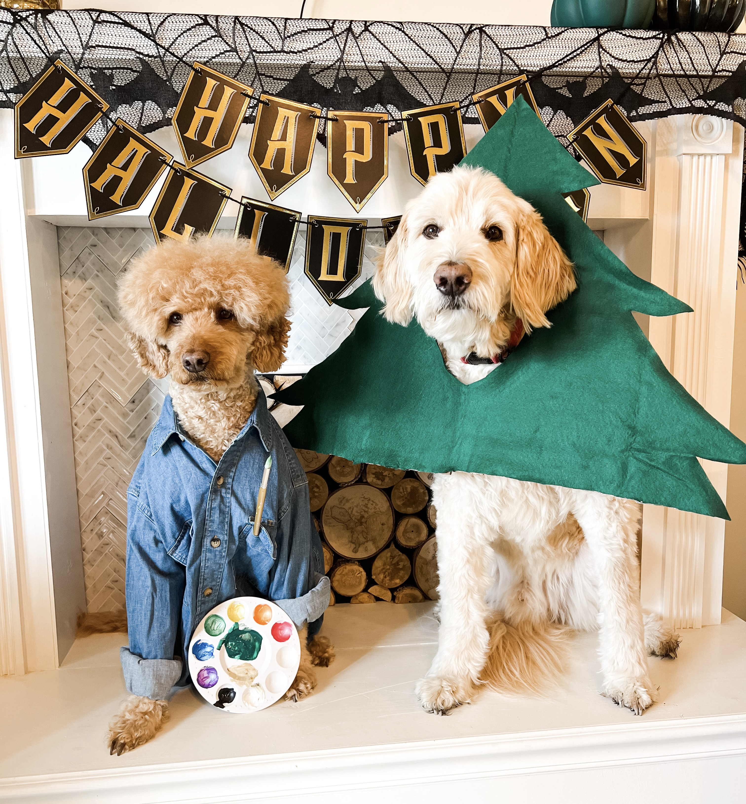

# **The Joyful World of Bob Ross**

## **Overview**

Bob Ross was an American painter, art instructor, and TV host. He is best remembered for his TV program,
 _The Joy of Painting_, where he introduced many to his quick and easy painting techniques for landscape painting. 
 Ross' soothing voice and positive messages about creativity and life have endeared him to millions worldwide. 

 ## **Early Life**

 Born in Dayton Beach, Florida, on October 29, 1942, Bob Ross developed a love for nature and animals. His 
 interest in art emerged as a young adult which he pursued alongside his military career in the U.S. air Force. 

 ## **The Joy of Painting**

 _The Joy of Painting_ aired its first episode on January 11, 1983. Over the course of 11 years, Ross taught
 viewers how to create landscapes, seascapes, and occasionally, portraits and still-life paintings. The show 
 was beloved for Ross' gentle and encouraging approach. 

   "Everyday is a good day when you paint" -Bob Ross
   

## **Painting Technique**

Bob Ross was known for his wet-on-wet oil painting technique, which allowed for completing a painting in a 
shorter amount of time. He also used larger brushes and palette knives, enabling him to create detailed nature 
scenes in each 30-minute episode. 

   "Happy little trees" -Bob Ross

## **Legacy**

Sadly, Bob Ross passed away on July 4, 1995, but his legacy continues. His approach to painting and his 
outlook on life continue to inspire new generations or artists and non-artists alike. 

## **Learn More**

For those interested in learning more about Bob Ross' techniques or more about his life, here are some
resources:

  * [Bob Ross' Official Website](https://www.bobross.com/)
  * [Bob Ross' YouTube Channel](https://www.youtube.com/channel/UCxcnsr1R5Ge_fbTu5ajt8DQ)
  * [Bob Ross: The Happy Painter Documentary](https://watchdocumentaries.com/bob-ross-the-happy-painter/)

Author, Kimberly Chin's, doodles, Chip and Breck, cosplaying as Bob Ross and his happy little tree for Halloween. Insipiration for this project. 

## **References**
Hajeck, D. (2016). The real bob ross: Meet the meticulous artist behind those happy trees. _NPR_ Retrieved February 14, 2024, from 
   [https://www.npr.org/2016/08/29/490923502/the-real-bob-ross-meet-the-meticulous-artist-behind-those-happy-trees](https://www.npr.org/2016/08/29/490923502/the-real-bob-ross-meet-the-meticulous-artist-behind-those-happy-trees)
   
